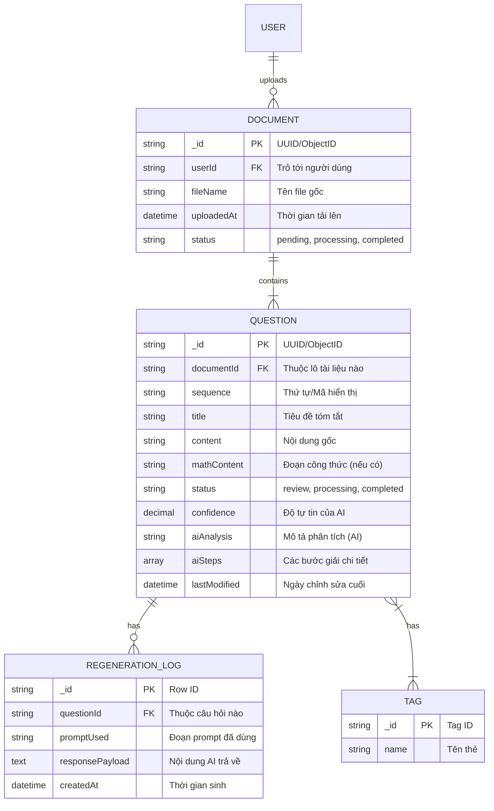

# QuizAI Pro - Markdown & AI Processing Workspace

Hệ thống quản lý, phân tích và giải bài tập tự động từ file văn bản thô bằng trí tuệ nhân tạo (Gemini API) với cơ chế xử lý hàng loạt, nhận diện lỗi tốc độ giới hạn (Rate limit) và luồng xử lý thời gian thực qua giao thức Server-Sent Events (SSE).

---

## Tính năng nổi bật hiện tại

1. **Trích xuất văn bản thông minh (Text Extraction):**
   - Đưa văn bản thô vào, tự động nhận diện và trích xuất thành danh sách các câu hỏi độc lập được định dạng chuẩn bằng Markdown và LaTeX.
   - Trực tiếp chỉnh sửa tên Đề bài (Document) và nội dung Markdown của từng câu hỏi ngay trên giao diện.
   - Giao tiếp với AI qua SSE streaming, hiện chữ ngay lập tức.

2. **Xác thực người dùng (Authentication & Phân quyền nội tại):**
   - Tích hợp hệ thống Đăng nhập / Đăng ký giả lập (Mock Auth) sử dụng JSON và `localStorage`, cho phép thử nghiệm nhanh mà không cần cài đặt Database CSDL gốc.
   - Giao diện người dùng có menu Profile, Avatar đóng mở, Hiển thị thông tin người dùng, Cài đặt và Đăng xuất rõ ràng.

3. **Giải bài tập từng bước (Step-by-step Solution):**
   - Phân tích và sinh lời giải chi tiết cho từng câu hỏi riêng biệt.
   - Cung cấp đáp án bằng Markdown & LaTeX với UI hiển thị trực quan (Split-view).

3. **Ghi nhận lịch sử tác vụ theo thời gian thực (Action History / Log Streaming):**
   - Giao diện cung cấp công cụ theo dõi luồng suy luận của AI (Action History).
   - Đo đạc thời gian thực thi cho từng tác vụ và phản hồi trực tiếp tới người dùng.

4. **Xử lý Hạn mức & Lỗi hệ thống mạnh mẽ (Rate Limiting & Error Handling):**
   - Tự động bắt lỗi **HTTP 429 (Too Many Requests)**. Tính toán độ trễ (delay) dự kiến nếu AI bị quá tải và thông báo trực quan tới người dùng.
   - Tự động nhận diện lỗi **Quota Exceeded (hết hạn mức sử dụng miễn phí mỗi ngày)**: Nhận diện chính xác gói Free tier của Gemini 2.5 Flash (20 requests/day).
   - Hiển thị thông báo hướng dẫn người dùng đợi hệ thống reset hạn mức (vào lúc 14:00 theo giờ Việt Nam đối với người dùng khu vực tương ứng).

---

## 📂 1. Cấu trúc thư mục (Folder Structure)

Cấu trúc mã nguồn được thiết kế theo dạng Module/Component của React (Vite) và tích hợp backend Express:

```text
/
├── assets/                 # Các tài nguyên tĩnh/tham khảo
├── src/                    # Mã nguồn chính của giao diện ứng dụng (Frontend)
│   ├── components/         # Các UI component có thể tái sử dụng
│   │   ├── BatchOperations.tsx # Component trích xuất và xử lý dữ liệu hàng loạt
│   │   ├── MainContent.tsx # Vùng hiển thị chi tiết câu hỏi & Kết quả sinh từ AI
│   │   ├── Sidebar.tsx     # Danh sách câu hỏi, biểu diễn trạng thái
│   │   └── TopNav.tsx      # Thanh điều hướng trên cùng, công cụ export
│   ├── utils/              # Các hàm tiện ích logic
│   │   └── textSplitter.ts # Logic xử lý bóc tách văn bản thô
│   ├── App.tsx             # Component gốc, khởi tạo layout chính và quản lý State
│   ├── data.ts             # Dữ liệu mẫu (Mock data)
│   ├── index.css           # CSS toàn cục (Tailwind CSS)
│   ├── main.tsx            # Điểm neo React vào file HTML
│   └── types.ts            # Định nghĩa các TypeScript Interface & Type
├── server.ts               # Backend Server (Node.js/Express) gọi Gemini API & SSE Stream
├── index.html              # HTML template chính
├── metadata.json           # Tuỳ chỉnh siêu dữ liệu app
├── tsconfig.json           # Cấu hình TypeScript
├── vite.config.ts          # Cấu hình Vite bundler
└── package.json            # Quản lý thư viện và scripts
```

---

## 🔄 2. Luồng dữ liệu (Data Flow)

Ứng dụng hoạt động theo quy trình từ lúc nhập dữ liệu đến xuất thành phẩm:

1. **Nhập liệu & Bóc tách (Ingestion & Splitting):**
   - Người dùng tải lên file đề bài `.md`.
   - Hệ thống (Text Splitter / Markdown AST) phân tách văn bản thành các object câu hỏi riêng biệt.

2. **Kiểm tra trùng lặp (Vector Search / Cache Hit):**
   - Đưa nội dung câu hỏi qua Vector DB (như ChromaDB/Pinecone). 
   - Đánh giá độ tương đồng (>90%) để dùng lại đáp án cũ, tiết kiệm chi phí gọi API.

3. **Hàng đợi & Phân luồng (Queuing):**
   - Các câu hỏi chưa có sẵn đáp án sẽ được đẩy vào Message Queue (Celery/Redis/BullMQ) để xử lý bất đồng bộ, tránh lỗi *Rate Limit* (nghẽn API).
   - Giao diện người dùng sẽ hiện trạng thái `Đang xử lý` (*Processing*).

4. **Tương tác AI (Prompting & Streaming):**
   - Prompt Engine tự động bọc câu hỏi với các chỉ thị ngữ cảnh (Context, Rules, Format: LaTeX).
   - Gọi AI API (Gemini, Claude, OpenAI) bằng giao thức Server-Sent Events (SSE). Chữ/Đáp án sẽ hiện ra theo thời gian thực (*Streaming*) trên khung chữ ở `MainContent`.

5. **Lưu trữ & Phản hồi (Storage & Response):**
   - Kết quả phản hồi được format lại dưới dạng Markdown và KaTeX, sau đó lưu vào Document Database lưu trữ.
   - Trạng thái trên UI cập nhật thành `Cần review` hoặc `Hoàn thành` dựa trên độ tự tin (Confidence score) hoặc check lỗi "Ảo giác" (Hallucination).

6. **Kiểm duyệt & Hiệu đính (Review & Edit):**
   - Người dùng kiểm tra ở giao diện. Cung cấp tính năng *Regenerate* để AI giải lại hoặc *Edit Result* để tự chỉnh sửa đáp án trực tiếp.
   - Nhấn *Approve & Save* để chốt kết quả vào DB.

---

## 🗄️ 3. Cấu trúc Database (Data schema & Relationships)

Hệ thống được đề xuất sử dụng cơ sở dữ liệu Document/NoSQL (như MongoDB) để linh hoạt lưu trữ Markdown, nhưng cấu trúc chuẩn hóa cho phép tra cứu (Tham chiếu khóa chính/Khóa phụ) như sau:



### Tệp tài liệu (Document / Batch)
Đại diện cho 1 lô bài tập tải lên (1 file `.md` gốc).
- **`_id`** (PK): UUID/ObjectID gốc của Đề bài.
- `userId` (FK): Trỏ tới người tạo/người upload.
- `fileName`: Tên file gốc (VD: *De_Thi_Thu_Toan_2026.md*).
- `uploadedAt`: Thời gian tải lên.
- `status`: Trạng thái xử lý của cả file (*pending, processing, completed*).

### Câu hỏi (Question) \- *Core Entity*
Quản lý trạng thái và nội dung chi tiết của từng câu hỏi nhỏ được bóc tách từ file.
- **`_id`** (PK): UUID/ObjectID của Câu hỏi.
- **`documentId`** (FK): Liên kết tới `_id` của Tệp tài liệu (Document).
- `sequence`: Thứ tự/Mã hiển thị (VD: `#001`).
- `title`: Tiêu đề tóm tắt.
- `content`: Nội dung thô gốc của câu hỏi dạng text/markdown.
- `mathContent`: Đoạn công thức toán học bị bóc tách (nếu có).
- `tags` (Array): Phân loại câu hỏi (VD: `['Toán', 'Giải tích', 'Khó']`). Có thể link qua bảng Tag riêng qua liên kết N-N.
- `status`: Trạng thái giải quyết của câu (`review`, `processing`, `completed`).
- `confidence` (Decimal): Độ tự tin của AI sau khi sinh (%).
- `aiAnalysis`: Phần mô tả chung do AI giải (Text/Markdown).
- `aiSteps` (Array of Strings): Các bước giải chi tiết được AI cung cấp.
- `lastModified`: Lưu vết thay đổi gần nhất.

### Tương tác tùy chỉnh (AI Re-generation Log) - *Lịch sử truy xuất*
Lưu lịch sử các lần "Regenerate" hoặc log kết quả AI tránh ghi đè làm mất phiên bản sinh tốt hơn.
- **`_id`** (PK): Row ID.
- **`questionId`** (FK): Trỏ tới `_id` của Question.
- `promptUsed`: Đoạn nhắc (Prompt) đã dùng để hỏi AI.
- `responsePayload`: Chuỗi trả về của AI.
- `createdAt`: Timestamp sinh ra câu trả lời.

### Cấu trúc Mock Local Storage (Lưu trữ tạm thời ở bản hiện tại)
Do đang chạy Mock Auth bằng `localStorage`, hệ thống sử dụng một mảng JSON có dạng cơ bản:
```json
[
  {
    "username": "demo",
    "password": "demo_password"
  }
]
```

---

## 👤 4. Cấu trúc Use Case (Usecase Structure)

Hệ thống cung cấp các luồng hành vi (Use Case) chính cho hai nhóm đối tượng: **Người dùng cuối (Teacher/Student)** và **Hệ thống (System/AI)**.

### Tác nhân (Actors)
1. **Người dùng (User/Admin):** Upload đề, kiểm duyệt đáp án, quản lý thư viện câu hỏi.
2. **Hệ thống AI (Gemini):** Nhận prompt, sinh nội dung đáp án (Streaming), phân tích cấu trúc lỗi.
3. **Hệ thống Core (Backend):** Lưu trữ, điều tiết Request Queue, bắt lỗi Rate Limit.

### Danh sách Use Cases chính

#### Nhóm 1: Quản lý Phiên & Phân quyền (Auth)
* **UC1.1 - Đăng nhập/Đăng ký:** Đăng nhập thông qua Mock Auth (`localStorage`).
* **UC1.2 - Xem/Chỉnh sửa Profile:** Mở menu Profile, xem tên tài khoản, đăng xuất.

#### Nhóm 2: Quản lý & Xử lý Tài liệu (Document)
* **UC2.1 - Tải lên tài liệu:** Kéo thả/chọn file `.md` chứa văn bản thô.
* **UC2.2 - Trích xuất tập hợp câu hỏi (Batch Parsing):** Tự động bóc tách file thành các câu hỏi theo format.
* **UC2.3 - Đổi tên tệp tài liệu:** Chỉnh sửa tên tập hợp câu hỏi trực tiếp trên Sidebar.

#### Nhóm 3: Tương tác & Trình chỉnh sửa Câu hỏi (Question Editor)
* **UC3.1 - Xem chi tiết câu hỏi:** Click vào câu hỏi bên Sidebar để hiển thị View Markdown.
* **UC3.2 - Chỉnh sửa nội dung Markdown:** Nhấn nút Sửa tài liệu, nhập liệu văn bản với preview trực tiếp.
* **UC3.3 - Xóa câu hỏi:** Loại bỏ câu khỏi khỏi danh sách hiện tại.

#### Nhóm 4: Tương tác Trí tuệ Nhân tạo (AI Processing)
* **UC4.1 - Sinh lời giải đơn lẻ (Generate Solution):** Call Gemini API lấy đáp án và Render KaTeX Streaming.
* **UC4.2 - Xử lý bài tập hàng loạt (Batch Processing):** Gọi API song song/tuần tự cho nhiều câu hỏi.
* **UC4.3 - Xem lịch sử suy luận (Action History):** Xem log các thao tác/thời gian trễ của AI.
* **UC4.4 - Xử lý Hạn mức (Handle Rate Limit):** Khi quá tải, hệ thống tự động khóa tính năng sinh và tính toán countdown cho người dùng.

```mermaid
usecaseDiagram
    actor User
    actor "Gemini API" as AI

    package "QuizAI Pro System" {
        usecase "Đăng nhập/Đăng ký" as UC1
        usecase "Upload File .md" as UC2
        usecase "Bóc tách câu hỏi" as UC3
        usecase "Chỉnh sửa tên đề / nội dung" as UC4
        usecase "Yêu cầu giải bài (Đơn/Hàng loạt)" as UC5
        usecase "Sinh đáp án thời gian thực (SSE)" as UC6
        usecase "Xử lý Lỗi/Rate Limit" as UC7
    }

    User --> UC1
    User --> UC2
    User --> UC4
    User --> UC5

    UC2 ..> UC3 : <<include>>
    UC5 ..> UC6 : <<include>>
    
    AI --> UC6
    AI --> UC7
```

---

### Mối quan hệ tổng quát:
* 1 **User** uploads N **Documents**.
* 1 **Document** contains N **Questions**.
* 1 **Question** has N **Re-generation Logs**.
* N **Questions** có N **Tags**.
